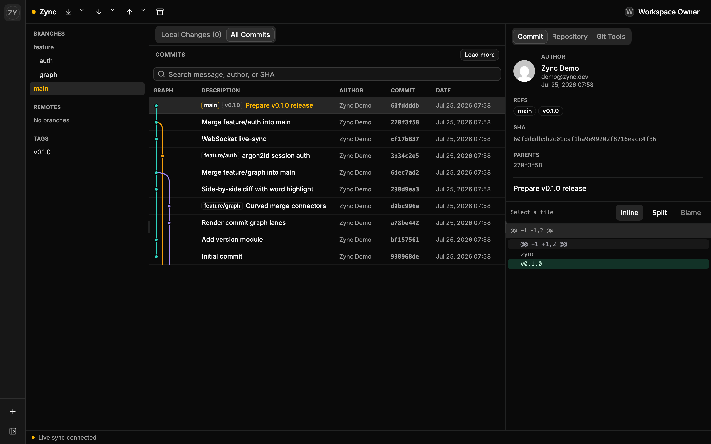

# Zync

A Fork-inspired Git workspace client you run yourself: a single Rust binary that
serves a fast React web UI — commit graph, diffs, branches, remotes, and live
sync — over your Git repositories on disk.



## Install

### Install script (single binary)

Linux and macOS (x86_64 and arm64):

```sh
curl -fsSL https://raw.githubusercontent.com/prongbang/zync/main/install.sh | sh
```

This installs the `zync-server` binary (the web UI is embedded in it). Then run
it and open <http://127.0.0.1:58271>:

```sh
ZYNC_SECRET_KEY="$(openssl rand -base64 32)" zync-server
```

A system `git` (and `ssh` for SSH remotes) must be installed. Override the
version or install location with `ZYNC_VERSION` and `ZYNC_INSTALL_DIR`.

### Docker

```sh
docker compose up --build
```

Then open <http://127.0.0.1:58271>. Mount host Git projects under `/workspaces`
in `docker-compose.yml` and add the mounted path in the UI.

### From source

Requires Rust and [bun](https://bun.sh):

```sh
cd web && bun install && cd apps/web && bun run build    # build the web UI
cargo build --release -p zync-server --features embed-ui # embed it into the binary
ZYNC_SECRET_KEY="$(openssl rand -base64 32)" ./target/release/zync-server
```

---

Production deployment, backups, and the HTTP API are documented in
[docs/DEPLOY.md](docs/DEPLOY.md), [docs/BACKUP.md](docs/BACKUP.md), and
[docs/API.md](docs/API.md).
